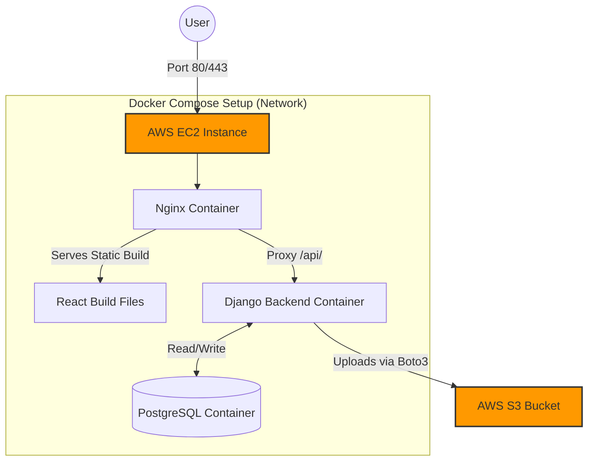

# Cloud Engineering Assignment - Notes CRUD App

This repository contains a containerized, full-stack CRUD application built for the Associate Cloud Engineer technical examination. The application is designed with a strong focus on infrastructure, security, and automated deployment best practices using AWS Free Tier services.

## 1. Architecture Design

The application consists of three main components running in isolated Docker containers:
*   **Frontend:** A React Single Page Application (SPA) built with Vite.
*   **Backend:** A Django REST Framework API served by Gunicorn.
*   **Database:** A PostgreSQL relational database.
*   **Storage:** Amazon S3 for file attachments.

All requests enter the system through an **Nginx Reverse Proxy**. Nginx serves the compiled React static files and proxies any requests starting with `/api/` or `/admin/` directly to the Django Gunicorn backend. The Django backend parses file uploads and securely streams them to an AWS S3 bucket.

### Infrastructure Diagram



## 2. Deployment Steps

Deployment is entirely automated via **GitHub Actions** CI/CD pipeline (`.github/workflows/deploy.yml`).

1.  **Repository Secrets setup:** Define the necessary secrets in GitHub:
    *   `EC2_HOST`, `EC2_USER`, `EC2_SSH_KEY` (Infrastructure access)
    *   `POSTGRES_DB`, `POSTGRES_USER`, `POSTGRES_PASSWORD` (Database credentials)
    *   `DJANGO_SECRET_KEY`, `ALLOWED_HOSTS` (App configuration)
    *   `AWS_ACCESS_KEY_ID`, `AWS_SECRET_ACCESS_KEY`, `AWS_STORAGE_BUCKET_NAME`, `AWS_S3_REGION_NAME` (S3 integration)
2.  **Auto-Deployment:** Upon committing and pushing to the `main` branch, the GitHub Action workflow:
    *   Connects to the EC2 instance via SSH.
    *   Installs Docker & Docker Compose natively (if missing).
    *   Pulls the latest code directly from the repository.
    *   Auto-generates the production `.env` file securely from GitHub Secrets.
    *   Rebuilds layers and restarts containers using `docker-compose up -d --build`.

## 3. IAM Configuration

To maintain **Least Privilege** security, a dedicated IAM User was created exclusively for the application's programmatic access. By avoiding full `AdministratorAccess` or broad `AmazonS3FullAccess` policies, the server is immune to cross-service lateral movement if compromised.

The specific inline policy (`iam-policy.json`) strictly restricts the user to *only* performing `PutObject`, `GetObject`, and `DeleteObject` actions specifically targeted at the application's unique bucket ARN:

```json
{
    "Version": "2012-10-17",
    "Statement": [
        {
            "Effect": "Allow",
            "Action": [
                "s3:PutObject",
                "s3:GetObject",
                "s3:DeleteObject"
            ],
            "Resource": "arn:aws:s3:::<YOUR-BUCKET-NAME>/*"
        }
    ]
}
```

## 4. Security Group Rules

The application enforces tight network security boundaries at the EC2 Virtual Private Cloud (VPC) level. The Security Group assigned to the EC2 instance restricts traffic to only what is publicly necessary. 

**Inbound Rules:**
*   **Port 80 (HTTP):** Allowed from `0.0.0.0/0` (Anywhere) - Required for serving the web application.
*   **Port 443 (HTTPS):** Allowed from `0.0.0.0/0` (Anywhere) - Required for secure SSL traffic.
*   **Port 22 (SSH):** Allowed only from `My IP` or specific Admin IPs - Prevents unauthorized shell access.

*Note: Port 5432 (PostgreSQL) and Port 8000 (Django) are intentionally **blocked/not exposed** to the public internet. They communicate strictly within the internal Docker bridge network.*

## 5. AWS Free Tier Setup & Resource Planning

The infrastructure was carefully engineered to reside 100% within the AWS Free Tier limitations to avoid unexpected billing.

*   **Compute (EC2):** Deployed on a single `t2.micro` instance (1 vCPU, 1 GiB Memory). Running 24/7 utilizes approximately 730/750 hours of the monthly free tier allowance.
*   **Database Isolation:** Instead of utilizing Amazon RDS (which consumes a separate free tier allowance and requires more setup overhead for this scale), PostgreSQL runs as an ephemeral but volume-persisted container directly on the EC2 host.
*   **Storage (EBS):** Utilizes a standard General Purpose `gp2` or `gp3` root EBS volume formatted at less than 30 GB (the Free Tier cap limit). 
*   **Storage (S3):** Images and attachments are directly offloaded from the EC2 instance to an S3 bucket instead of local storage, utilizing the 5GB standard storage free tier allowance efficiently and promoting stateless application design.

### Scaling and Backup Strategy for the Future

If traffic increases past the limits of a simple `t2.micro` setup:
1.  **Scaling:** The Dockerized DB will be migrated to **Amazon RDS** (allowing vertical scaling and Multi-AZ). The EC2 instance acting as the web server will be attached to an **Auto Scaling Group (ASG)** routed behind an **Application Load Balancer (ALB)**.
2.  **Backups:** Enable **Point-in-Time Recovery (PITR)** on the RDS block, enable **S3 Object Versioning** for accidental file deletion recovery, and schedule **EBS Snapshots** dynamically via Amazon Data Lifecycle Manager (DLM).
